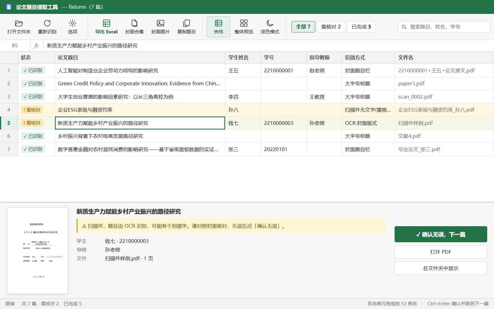
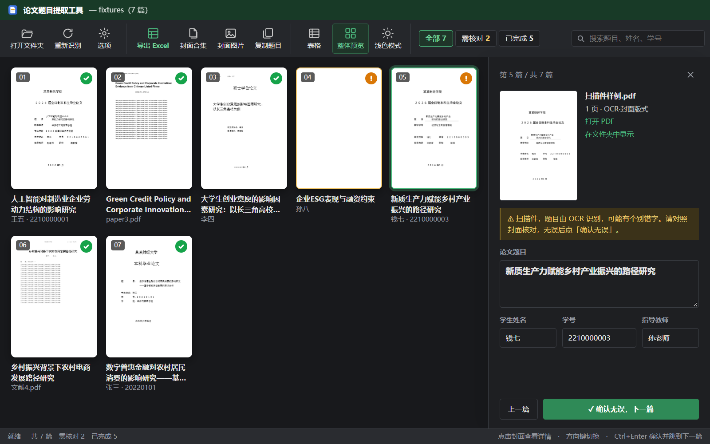

<div align="center">


# 论文题目提取工具

把一个文件夹里的论文 PDF 拖进来，自动读出每篇论文的**题目、学生姓名、学号、指导教师**，<br/>
一键导出 Excel 汇总表，或把所有封面合并成一个 PDF。

</div>



<details><summary>整体预览（封面墙）· 深色模式</summary>



</details>

## 功能

- **批量识别题目**：支持学位论文 / 毕业论文封面、中英文期刊论文，题目跨两行也能完整读出。
- **顺带读出封面信息**：学生姓名、学号、指导教师；封面上没有时，会从「学号+姓名+论文.pdf」这类文件名中补全。
- **扫描件 OCR**：整页是图片的扫描件，调用 Windows 自带的 OCR 识别封面——完全离线，不上传任何内容，也不增加安装包体积。
- **两种视图随时切换**
  - **表格**（默认）：像 Excel 一样，选中单元格直接打字或在编辑栏里修改，底部显示所选论文的封面；
  - **整体预览**：所有封面排成一面墙，空白页、扫描件一眼就能看出来，点击封面在右侧修改。
- **对照封面逐篇核对**：拿不准的会标黄并说明原因，改好后点「确认无误，下一篇」。
- **深色模式**：默认跟随系统，也可以在功能区手动切换。
- **导出**
  - Excel 汇总表（序号、题目、姓名、学号、导师、页数、文件名、识别方式；需核对的行标黄）
  - 封面合集 PDF（每篇论文的第 1 页依次排列，带书签）
  - 封面图片（每篇一张 PNG）
- 一键复制全部题目，直接粘贴到 Word / Excel。

## 下载安装

到 [Releases](../../releases) 页面下载最新版本：

| 文件 | 说明 |
| --- | --- |
| `论文题目提取工具_x.y.z_x64-setup.exe` | **推荐**。双击安装，无需管理员权限 |
| `论文题目提取工具_x.y.z_x64_zh-CN.msi` | 适合学校机房统一部署 |

支持 Windows 10 / 11。软件依赖系统自带的 WebView2，Windows 10 较老的版本如果缺少，安装程序会自动下载。

## 使用方法

1. 把存放论文 PDF 的文件夹拖进窗口，或点击「选择文件夹」。
   论文放在多层子文件夹里时，打开「包含子文件夹」。
2. 识别完成后，点「需核对」只看拿不准的论文，对照封面修改，点「确认无误，下一篇」。
   想一眼看全部封面时，点功能区的「整体预览」。
3. 点击功能区的「导出 Excel」「封面合集」「封面图片」或「复制题目」。

| 快捷键 | 作用 |
| --- | --- |
| <kbd>↑</kbd> <kbd>↓</kbd> <kbd>←</kbd> <kbd>→</kbd> | 切换单元格 / 封面 |
| 直接打字、<kbd>F2</kbd>、双击 | 修改当前单元格，<kbd>Enter</kbd> 保存并到下一行，<kbd>Esc</kbd> 取消 |
| <kbd>Ctrl</kbd>+<kbd>Enter</kbd> | 确认无误并跳到下一篇 |
| <kbd>Ctrl</kbd>+<kbd>F</kbd> | 搜索 |

## 识别原理

所有处理都在本机完成，按可信度从高到低依次尝试：

| 识别方式 | 说明 |
| --- | --- |
| 封面题目栏 | 在封面上找「题目 / 论文题目 / Title」，取标签右侧的文字。能处理表格式封面里题目分两行、第一行高于标签的排版 |
| 大字号标题 | 取页面上字号明显最大的一段文字，跳过校名、「毕业论文」、期刊名、卷期号等 |
| 封面版式 | 题目标签缺失时，取第一个栏目（教学学院、学生姓名等）正上方的几行 |
| OCR·… | 扫描件先用 Windows OCR 识别出文字，再按上面的规则处理。OCR 可能认错个别字，因此标黄提示核对 |
| PDF属性 / 文件名 | 以上都失败时的兜底，标黄提示核对 |

## 常见问题

**扫描件识别不出来？**
确认勾选了「扫描件 OCR」。OCR 需要系统安装中文识别语言：中文版 Windows 默认已安装；英文版 Windows 可在「设置 → 时间和语言 → 语言」中添加「中文(简体)」。

**某种封面格式总是识别不准？**
欢迎在 [Issues](../../issues) 反馈，最好附上**去掉个人信息后**的封面截图。

**论文会上传到网上吗？**
不会。软件不联网，PDF 解析、OCR、导出全部在本机完成。

## 开发

需要 [Node.js](https://nodejs.org/) 22+、[Rust](https://www.rust-lang.org/tools/install) 和 [Tauri 的系统依赖](https://tauri.app/start/prerequisites/)。

```bash
npm install
npm run tauri dev     # 启动开发版
npm test              # 运行识别规则的测试
npm run tauri build   # 打包安装程序，输出在 src-tauri/target/release/bundle/
```

用自己手上的真实论文检验识别效果（只在本地运行，不会提交）：

```bash
SAMPLES_DIR="D:/论文样本" npx vitest run tests/samples.test.ts
```

> ⚠️ 真实论文包含学生个人信息，请不要提交到仓库。`samples/`、`local-samples/` 目录已在 `.gitignore` 中忽略。
> `tests/fixtures/` 里的样例都是虚构内容。

### 目录结构

```
src/
  extractor.ts   题目识别规则（纯 TypeScript，可在 Node 中测试）
  ocr.ts         扫描件：渲染页面 → 调用 Windows OCR
  exporters.ts   导出 Excel / 封面 PDF / 封面图片
  pdf.ts         pdf.js 配置与页面渲染
  main.ts        界面
src-tauri/src/
  lib.rs         文件读写、打开文件等系统接口
  ocr.rs         Windows.Media.Ocr 封装
tests/           识别规则测试与虚构样例
```

### 技术栈

[Tauri 2](https://tauri.app/) · TypeScript · [pdf.js](https://mozilla.github.io/pdf.js/) · [pdf-lib](https://pdf-lib.js.org/) · [ExcelJS](https://github.com/exceljs/exceljs) · Windows.Media.Ocr

## 许可证

[MIT](LICENSE)
